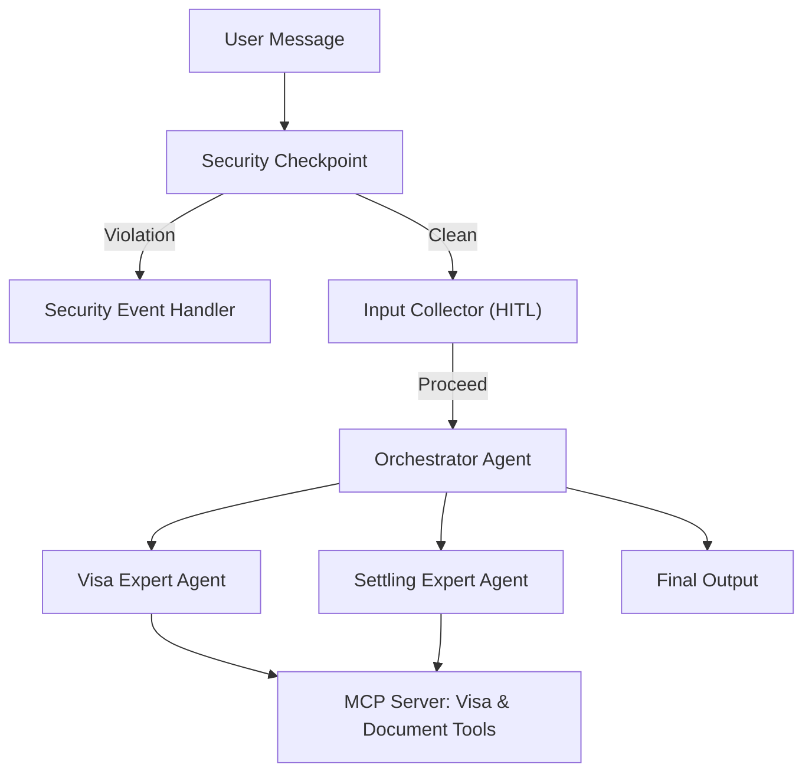

# Submission Writeup: Prague Relocator

## Problem Statement
Moving to a new country can be an administrative nightmare. Foreigners relocating to Prague face a complex maze of immigration options, confusing Czech Ministry of Interior (MVCR) rules, and local registrations (Foreign Police, trade licensing, health insurance). Official information is often spread across multiple portals, fragmented, or only available in Czech. Prague Relocator solves this by offering a secure, conversational, and highly structured guide that provides accurate relocation pathways based on the user's specific background.

## Solution Architecture

## Concepts Used

1. **ADK 2.0 Workflow (Graph)**: Implemented in [agent.py](file:///Users/aleksandrkim/Documents/ADK-Workspace/prague-relocator/app/agent.py#L173-L186). The entire agent is structured as a deterministic graph workflow running node-by-node.
2. **LlmAgent**: Used for our three intelligent agents: `orchestrator` (the master router), `visa_expert` (immigration specialist), and `settling_expert` (housing/insurance specialist).
3. **AgentTool**: Wired in the `orchestrator` instruction and tools list to delegate queries to the specialist agents: `AgentTool(visa_expert)` and `AgentTool(settling_expert)`.
4. **MCP Server**: Defined in [mcp_server.py](file:///Users/aleksandrkim/Documents/ADK-Workspace/prague-relocator/app/mcp_server.py). The server is run via standard input/output (`stdio`) and provides structured real-time data back to the LLMs.
5. **Security Checkpoint**: The `security_checkpoint` function node in [agent.py](file:///Users/aleksandrkim/Documents/ADK-Workspace/prague-relocator/app/agent.py#L72-L130) intercepts all incoming messages to scrub PII, block prompt injections, and enforce legal compliance.
6. **Agents CLI**: Scaffolding (`agents-cli scaffold create`) and running (`make playground` / `make run`) to manage the project life-cycle.

## Security Design

To protect user confidentiality and prevent exploitation:
* **PII Scrubbing**: Using regular expressions, we detect and redact passport numbers, dates of birth, phone numbers, and email addresses. This is critical for preventing personal identity data leakages to the LLM model endpoints.
* **Prompt Injection Defense**: Scans input text for hijacking phrases (e.g. `"ignore previous instructions"`) and redirects immediately to a safe, terminal security event block.
* **Domain-Specific Policy**: Block queries related to illegal border crossings or working without authorization. If found, a `WARNING` or `CRITICAL` audit log is printed to standard output in structured JSON format, and the flow is halted.
* **Structured Audit Logging**: Outputs JSON log entries on every query check, indicating if PII was redacted or violations were flagged.

## MCP Server Design

The Model Context Protocol (MCP) server acts as a source of truth for Czech guidelines, providing:
1. `get_visa_requirements(nationality, purpose)`: Recommends Employee Card, Student Visa, Živnostenský list, or Temporary Residence based on citizenship.
2. `get_required_documents(permit_type)`: Pulls precise document checklists (financial minimums, police clearances, translation rules).
3. `get_office_locations(office_type)`: Returns OAMP offices (Prague III Letná, Prague II Cigánkova), Foreign Police (Olšanská), or Trade Offices with address details and instructions.
4. `get_health_insurance_info(duration_months)`: Details health coverage laws (comprehensive private pVZP requirements or public health integration for employees).

## Human-in-the-Loop (HITL) Flow

Relocation guidelines depend entirely on who you are. Instead of throwing a generic document wall at the user, the agent uses the **ADK Workflow `RequestInput`** mechanism in `input_collector`. 
* If a user says `"I want to move to Prague"`, the collector pauses execution and prompts: `"Ahoj! Welcome to Prague Relocator. What is your nationality?"`
* The session state persists the answers.
* Next, it checks if a purpose is defined, if not: `"What is your purpose of stay?"`
* Once both parameters are gathered and stored in `ctx.state`, the workflow proceeds to the LLM Orchestrator. This ensures the LLM receives all crucial facts from the start, avoiding hallucinations.

## Demo Walkthrough

The project supports three core user journeys (see detailed steps in [README.md](file:///Users/aleksandrkim/Documents/ADK-Workspace/prague-relocator/README.md)):
1. **Accredited Student Path**: Non-EU students are guided through the 60-day visa study checklist, required funds, and translation verification.
2. **Trade License Freelancer**: Americans or other third-country nationals receive instructions on how to register for a trade license ("Živnostenský list") first.
3. **Emergency Checklists**: Exposing health insurance updates and the exact address of Prague's Foreign Police on Olšanská street for mandatory 3-day address registration.

## Impact / Value Statement
Prague Relocator acts as an empathetic, multilingual digital assistant that reduces anxiety for relocating expats. By automating regulatory navigation, it helps newcomers settle into Prague safely, legally, and with high confidence, while ensuring all data shared remains protected.
